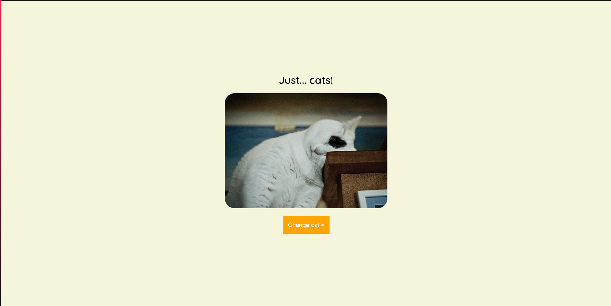

# Gatinhos 🐱

Este é uma página feita para aprender como que utiliza a função **fetch()** para fazer requisições assíncronas utilizando promises, onde uma API que renderiza foto de gatos. Há também, um botão que troca a foto atual.

 - Site para utilizar a API: [The Cat API](https://thecatapi.com)

- Segue abaixo, uma screenshot para exemplificar a tela:

É isso :smiley: